# Physics-Informed Neural Networks for Robot Inverse Dynamics: A Systematic Comparison of Data-Driven and Structured Approaches

**Platform**: Kikobot 6-DOF Serial Manipulator &nbsp;&nbsp;·&nbsp;&nbsp; **Date**: April 2026

---

## Abstract

Accurate inverse dynamics models are indispensable for torque-level control of robotic manipulators, yet even carefully calibrated rigid-body models carry systematic residuals arising from unmodelled elasticity, gear compliance, and imprecisely identified inertial parameters. This work presents a systematic comparison of six feedforward neural network architectures for inverse dynamics estimation on the five-joint Kikobot serial manipulator, spanning a spectrum from a purely data-driven black-box baseline to fully decomposed physics-structured networks in which the Newton-Euler equation is embedded architecturally. All six models are trained on a shared, trajectory-stratified dataset of 272,465 samples under identical optimisation conditions, and evaluated on 43,093 held-out test samples drawn from 13 trajectories not seen during training. We find that every physics-informed variant outperforms the black-box baseline in terms of test RMSE, with improvements ranging from 2.4% (Residual Correction) to 6.0% (Equation-Constrained PINN). The best single-run result is 0.09377 N·m (normalised) for the Equation-Constrained PINN versus 0.09977 N·m for the black-box baseline. Notably, a simple soft physics-loss term achieves performance within 0.7% of the most elaborately structured model, suggesting that with nearly 300k well-diversified training samples the dominant benefit of physics is regularisation rather than structural inductive bias.

---

## 1. Introduction

Controlling a robotic manipulator at the joint-torque level requires a model mapping joint positions $q \in \mathbb{R}^n$, velocities $\dot{q}$, and accelerations $\ddot{q}$ to the torques $\tau \in \mathbb{R}^n$ required to execute a desired motion. Classical analytical approaches derive this map through the recursive Newton-Euler algorithm (RNEA), but the resulting predictions depend on accurate identification of link masses, centre-of-mass positions, inertia tensors, and friction coefficients — a process that is time-consuming, difficult for complex geometries, and produces models that still carry residuals of 5–15% of the torque range on real hardware.

Data-driven alternatives learn the inverse dynamics map directly from joint-state and torque observations, bypassing explicit identification. Purely black-box neural networks have demonstrated competitive accuracy on benchmark manipulators, but they ignore the rich structural knowledge encoded in the Newton-Euler equations — symmetries, energy passivity, and the physical constraint that the joint-space inertia matrix must be symmetric positive definite — and consequently tend to extrapolate poorly to out-of-distribution configurations.

Physics-informed neural networks (PINNs) occupy a principled middle ground, incorporating physical laws either as soft constraints added to the training loss or as hard priors embedded in the network architecture. For robot inverse dynamics, this has motivated a variety of approaches: adding an RNEA consistency term to the loss, augmenting the input with precomputed analytical torques, structuring the network to predict Lagrangian equation components separately, and correcting each dynamical term individually. Despite growing interest, systematic comparisons across architectures — controlling for dataset size, optimiser, data preprocessing, and hyperparameter budgets — remain scarce.

This paper documents six architectures implemented for the Kikobot robot, characterises their mathematical structure precisely from the source code, and evaluates them under a controlled experimental protocol. We address three questions: (i) does incorporating physics knowledge improve test accuracy on real robot data with large training sets; (ii) which form of physics incorporation is most effective; and (iii) are there training stability or computational trade-offs that affect practical deployability?

---

## 2. Robot Platform and Data Acquisition

### 2.1 Hardware

The Kikobot is a six-degree-of-freedom serial manipulator with five independently actuated joints. From base to end-effector: J0 (base yaw), J1 (shoulder), J2 (elbow), J3 (wrist pitch), and J4 (wrist roll). Joints J0, J1, J2, and J4 are driven by Feetech STS3215 servo motors with a rated stall torque of $T_\text{stall} = 30.0\;\text{kgf}\cdot\text{cm}$. Joint J3 uses the smaller STS3032, rated at $T_\text{stall} = 14.8\;\text{kgf}\cdot\text{cm}$. All servos operate from a nominal supply voltage of $V_\text{nom} = 12.0\;\text{V}$.

### 2.2 Torque Measurement

Each servo exposes a 12-bit load register $\ell_i \in [-1000, 1000]$ proportional to motor current and hence to output torque. Converting to Newton-metres in the URDF joint frame proceeds in two steps. First, the servo-frame torque is

$$\tau_{\text{servo},i} = \ell_i \times 10^{-3} \times T_{\text{stall},i} \times \frac{V_i}{V_\text{nom}} \times 0.09807 \quad [\text{N}\cdot\text{m}],$$

where the factor $0.09807\;\text{N}\cdot\text{m}/(\text{kgf}\cdot\text{cm})$ converts from the rated stall torque units. Second, the URDF joint torque is

$$\tau_{\text{URDF},i} = -\,\text{dir}_i \cdot \tau_{\text{servo},i},$$

where $\text{dir}_i \in \{-1, +1\}$ accounts for the sign convention between the servo's positive-load direction and the URDF positive-joint-angle direction. A positive URDF torque accelerates the joint in the direction of increasing $q_i$.

### 2.3 State Estimation

Raw encoder ticks are converted to joint angles by

$$q_i = \text{dir}_i \cdot (\text{ticks}_i - \text{ticks}_{\text{centre},i}) \cdot \delta_\text{rad},$$

where $\delta_\text{rad}$ is the encoder resolution in radians per tick and $\text{ticks}_{\text{centre},i}$ is the neutral-position offset.

Joint velocities and accelerations are estimated by fitting a third-order Savitzky-Golay polynomial over a sliding window of $w = 25$ samples and differentiating analytically. Crucially, both $\dot{q}$ (derivative order 1) and $\ddot{q}$ (derivative order 2) are derived from the **same** polynomial fit to $q(t)$, ensuring that $\ddot{q} = \tfrac{d}{dt}\dot{q}$ exactly within the polynomial approximation. This internal consistency matters for the inertia term in the Newton-Euler equation, where an independently estimated $\ddot{q}$ would introduce artificial mismatch with $\dot{q}$.

To suppress occasional encoder glitches, both signals are hard-clipped:

$$|\dot{q}_i| \leq 100\;\text{rad/s}, \qquad |\ddot{q}_i| \leq 1000\;\text{rad/s}^2.$$

### 2.4 Feature Normalisation

All input features and output targets are z-score normalised per joint using statistics computed exclusively on the training split:

$$\tilde{x}_j = \frac{x_j - \mu_j}{\max(\sigma_j,\, 10^{-8})},$$

where the $10^{-8}$ floor prevents division by zero for near-constant joints. The 15-dimensional input feature vector is

$$\mathbf{x} = [\tilde{q},\, \tilde{\dot{q}},\, \tilde{\ddot{q}}] \in \mathbb{R}^{15}.$$

The 20-dimensional physics tensor $[\tau_g, \tau_M, \tau_C, \tau_f] \in \mathbb{R}^{20}$ is normalised with a component-aware scheme that preserves the additive invariant: when the four normalised components are summed and rescaled, the result equals the normalised total torque. Concretely,

$$\mu^\text{phys} = \left[\frac{\mu_\tau}{4},\ldots,\frac{\mu_\tau}{4}\right] \in \mathbb{R}^{20}, \qquad \sigma^\text{phys} = [\sigma_\tau,\ldots,\sigma_\tau] \in \mathbb{R}^{20},$$

so that $\sum_{k=0}^{3}\tilde{\tau}_{k,j} = \tilde{\tau}_j$ in normalised target space.

### 2.5 Dataset Construction and Splits

The dataset comprises 100 independently recorded trajectories covering representative operational motions of the robot (pick-and-place, sinusoidal sweeps, random joint-space excitation). Trajectories are assigned to splits at the trajectory level using stratified sampling by motion-geometry type with random seed 42, yielding a 70/15/15 partition:

| Split | Trajectories | Samples |
|:---:|:---:|:---:|
| Train | 69 | 272,465 |
| Validation | 18 | 53,779 |
| Test | 13 | 43,093 |

The trajectory-level split ensures that consecutive time-correlated samples from the same motion appear in only one split, preventing the data leakage that would occur with sample-level random splits.

---

## 3. Physics of Robot Inverse Dynamics

### 3.1 Rigid-Body Equations of Motion

For an $n$-joint rigid-body robot the inverse dynamics equation in joint space is

$$\boldsymbol{\tau} = \mathbf{M}(q)\,\ddot{q} + \mathbf{C}(q,\dot{q})\,\dot{q} + \mathbf{g}(q) + \mathbf{f}(\dot{q}),$$

where $\mathbf{M}(q) \in \mathbb{R}^{n\times n}$ is the joint-space inertia matrix (symmetric positive definite), $\mathbf{C}(q,\dot{q})\dot{q}$ collects Coriolis and centrifugal contributions, $\mathbf{g}(q)$ is the gravitational torque vector, and $\mathbf{f}(\dot{q})$ models joint friction. Each term is computed separately via Pinocchio's RNEA:

$$\tau_g = \text{RNEA}(q,\,\mathbf{0},\,\mathbf{0}),$$
$$\tau_M = \text{RNEA}(q,\,\mathbf{0},\,\ddot{q}) - \tau_g,$$
$$\tau_C = \text{RNEA}(q,\,\dot{q},\,\mathbf{0}) - \tau_g.$$

The Kikobot URDF uses a uniform mass density scale factor $\alpha_m = 0.09310315$ relative to nominal PLA, calibrated to account for the approximately 70% infill ratio of the printed links.

### 3.2 Friction Model

The nominal friction model employs a smooth Coulomb-plus-viscous parameterisation that avoids the discontinuity at $\dot{q} = 0$:

$$f_i(\dot{q}_i) = c_i\,\tanh\!\left(\frac{\dot{q}_i}{\varepsilon}\right) + v_i\,\dot{q}_i, \quad \varepsilon = 0.040469\;\text{rad/s}.$$

The calibrated coefficients for the five active joints are given in Table 1. Figure 1 plots the resulting friction torque curves decomposed into viscous and Coulomb contributions.

| Joint | Type | $c_i$ (N·m) | $v_i$ (N·m·s/rad) |
|:---:|:---:|:---:|:---:|
| J0 (yaw) | STS3215 | 0.134975 | 0.300000 |
| J1 (shoulder) | STS3215 | 0.278199 | 0.300000 |
| J2 (elbow) | STS3215 | 0.201313 | 0.245417 |
| J3 (wrist pitch) | STS3032 | 0.088112 | 0.040191 |
| J4 (wrist roll) | STS3215 | 0.203864 | 0.046918 |

*Table 1: Calibrated Coulomb ($c_i$) and viscous ($v_i$) friction coefficients for the five active joints.*

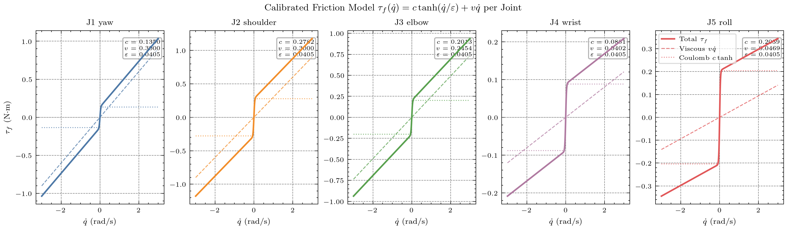

*Figure 1: Calibrated friction torque $f_i(\dot{q}_i) = c_i\tanh(\dot{q}_i/\varepsilon) + v_i\dot{q}_i$ for each joint. Solid: total friction; dashed: viscous term $v_i\dot{q}_i$; dotted: Coulomb term $c_i\tanh(\dot{q}_i/\varepsilon)$. J1 (shoulder) exhibits the largest Coulomb coefficient owing to higher mechanical preload; J3 (wrist pitch, STS3032) shows almost purely viscous behaviour due to its lighter construction.*

### 3.3 Symmetric Positive-Definite Inertia Parameterisation

A physically valid inertia matrix must be symmetric positive definite (SPD). Two of the six architectures (Models D and E.2) parameterise $\mathbf{M}(q)$ via its lower-triangular Cholesky factor $\mathbf{L}$, constructed from 15 raw network outputs (for $n=5$ joints, $\frac{5\cdot 6}{2} = 15$ entries):

$$L_{ij}(\tilde{q}) = \begin{cases} \text{softplus}(\tilde{L}_{ii}) + \varepsilon_\text{SPD} & i = j \\ \tilde{L}_{ij} & i > j \end{cases}, \qquad \mathbf{M} = \mathbf{L}\mathbf{L}^\top + \varepsilon_\text{SPD}\,\mathbf{I},$$

with $\varepsilon_\text{SPD} = 10^{-4}$. This double regularisation — via `softplus` on the diagonal and the additive $\varepsilon_\text{SPD}\mathbf{I}$ — guarantees $\lambda_{\min}(\mathbf{M}) \geq \varepsilon_\text{SPD}$ for all inputs.

**Initialisation.** The final linear layer of the inertia sub-network is initialised with weights drawn from $\mathcal{N}(0, 10^{-3})$. Biases at positions corresponding to diagonal Cholesky entries are set to $-2.0$, giving $\text{softplus}(-2.0) \approx 0.126$ and therefore $M_{ii} \approx 0.016$ at initialisation. Off-diagonal biases are set to zero. This keeps the inertia matrix small but non-degenerate at the start of training. Setting all biases to $-10$ (as earlier experiments found) gives $\text{softplus}(-10) \approx 4.5\times10^{-5}$, making $\tau_M \approx 0$ and $\partial\tau_M/\partial\theta \approx 0$, which produced initial losses of order $10^5$ and required roughly 15 wasted epochs to escape.

### 3.4 Dissipative Friction Parameterisation

For models that learn friction directly, the dissipation constraint $\tau_f \cdot \dot{q} \leq 0$ is enforced architecturally rather than by a penalty term. The friction sub-network $\text{f\_net}: \tilde{\dot{q}} \mapsto \mathbb{R}^{2n}$ outputs viscous and Coulomb coefficient vectors, and the friction torque is assembled as

$$\hat{\tau}_f = -\left[\,\text{softplus}\bigl(\mathbf{v}(\tilde{\dot{q}})\bigr) \odot \tilde{\dot{q}} \;+\; \text{softplus}\bigl(\mathbf{c}(\tilde{\dot{q}})\bigr) \odot \tanh\!\left(\frac{\tilde{\dot{q}}}{0.04}\right)\right].$$

The `softplus` activations ensure strictly positive coefficients; combined with the explicit negative sign and the fact that $x\tanh(x/\varepsilon) \geq 0$, this guarantees $\hat{\tau}_{f,j}\,\tilde{\dot{q}}_j \leq 0$ element-wise for all inputs, without requiring any loss-based penalty.

### 3.5 Learnable Physics Calibration

To close the gap between the nominal URDF model (with its approximate mass scale and fixed friction constants) and the real robot, physics-aware models (B and E.1) employ a learnable per-joint affine calibration layer $\varphi$:

$$\varphi(\tau_\text{eq}) = \text{diag}\!\left(\text{softplus}(\mathbf{z}) + 10^{-5}\right)\,\tau_\text{eq} + \mathbf{b}.$$

This is implemented in `TauEquationCalibration`. The raw scale parameter is initialised as $z_j = \ln(e - 1)$, giving $\text{softplus}(z_j) = 1.0$ and therefore $s_j = 1.0 + 10^{-5} \approx 1.0$ at the start of training. The bias is initialised to zero. The resulting calibration is the identity map at initialisation, so the physics signal passes through unchanged until the model has learned enough to deviate profitably.

A regularisation term prevents $\varphi$ from drifting arbitrarily far from the identity:

$$\mathcal{L}_\text{calib} = \frac{1}{n}\sum_{j=1}^{n}\!\left[(s_j - 1)^2 + b_j^2\right].$$

This term appears with weight $0.01$ inside the physics loss of Models B and E.1.

---

## 4. Neural Network Architectures

### 4.1 Shared Building Block

All six architectures use the same MLP building block defined in `models/common.py`. Each hidden layer consists of:

$$h_k = \text{Dropout}_p\!\left(\sigma\!\left(\text{LayerNorm}\!\left(\mathbf{W}_k h_{k-1} + \mathbf{b}_k\right)\right)\right), \quad k = 1,\ldots,L,$$

where $\sigma$ denotes the activation function and `LayerNorm` normalises over the feature dimension. The final layer is a plain linear projection. Table 2 summarises the architecture hyperparameters for each model.

| Model | Activation | Dropout | Hidden layers |
|:---:|:---:|:---:|:---:|
| A (BlackBox) | SiLU | 0.10 | [256, 512, 256] |
| B (PhysicsReg) | SiLU | 0.10 | [256, 512, 256] |
| C (ResidualCorr) | tanh | 0.10 | [256, 512, 256] |
| D (Lagrangian) | tanh | 0.05 | M/C/g: [256,512,256]; f: [128,128] |
| E.1 (EC-PINN) | SiLU | 0.10 | [256, 512, 256] |
| E.2 (Decomposed) | tanh | 0.05 | M/C/g: [256,512,256]; f: [128,128] |

*Table 2: Per-model architecture hyperparameters as set in `config/hp_registry.py` and `core/builder.py`.*

Individual architecture diagrams (Figures 2a–2f) are presented at the start of each model's subsection (§§4.2–4.7). Each diagram shows the complete data flow, sub-network structure, and training loss terms specific to that model.

### 4.2 Model A — Black-Box FNN

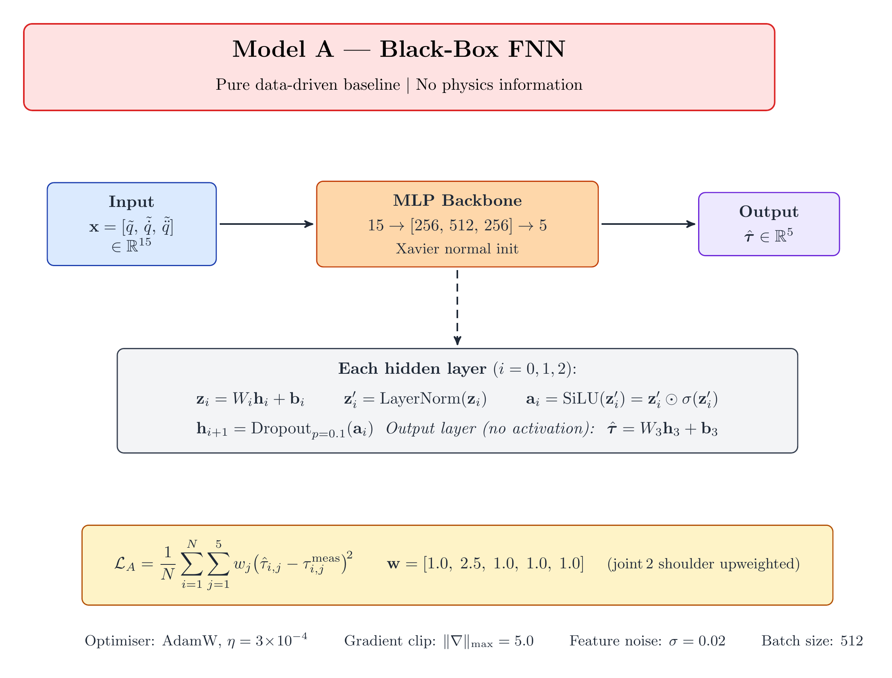

*Figure 2a: Model A — Black-Box FNN. The 15-dimensional normalised kinematic feature vector $[\tilde{q}, \tilde{\dot{q}}, \tilde{\ddot{q}}]$ feeds a three-hidden-layer MLP [256, 512, 256] with SiLU activations, per-layer LayerNorm, and Dropout(p=0.1), followed by a linear output projection to $\mathbb{R}^5$. The training loss applies joint-importance weights $\mathbf{w} = [1.0, 2.5, 1.0, 1.0, 1.0]$. No physics signal is used anywhere.*

The black-box baseline is an unconstrained MLP mapping the 15-dimensional normalised kinematic feature vector directly to torque:

$$\hat{\tau} = \text{MLP}_\theta(\mathbf{x}), \quad \mathbf{x} = [\tilde{q},\,\tilde{\dot{q}},\,\tilde{\ddot{q}}] \in \mathbb{R}^{15}.$$

The training loss is a joint-importance-weighted MSE:

$$\mathcal{L}_A = \frac{1}{BJ}\sum_{b=1}^{B}\sum_{j=1}^{J} w_j\,(\hat{\tau}_{bj} - \tau_{bj}^{\text{meas}})^2, \quad \mathbf{w} = [1.0,\,2.5,\,1.0,\,1.0,\,1.0].$$

The 2.5-fold upweighting of J1 (shoulder, index 1) compensates for its systematically larger torque magnitude: without this weighting, the shoulder's large absolute errors dominate the gradient and the four remaining joints receive insufficient training signal. Validation and test RMSE are always computed without joint weighting (i.e., $\mathbf{w} = \mathbf{1}$).

There is no physics signal anywhere in Model A; it serves as the reference point for all comparisons.

### 4.3 Model B — Physics-Regularized FNN

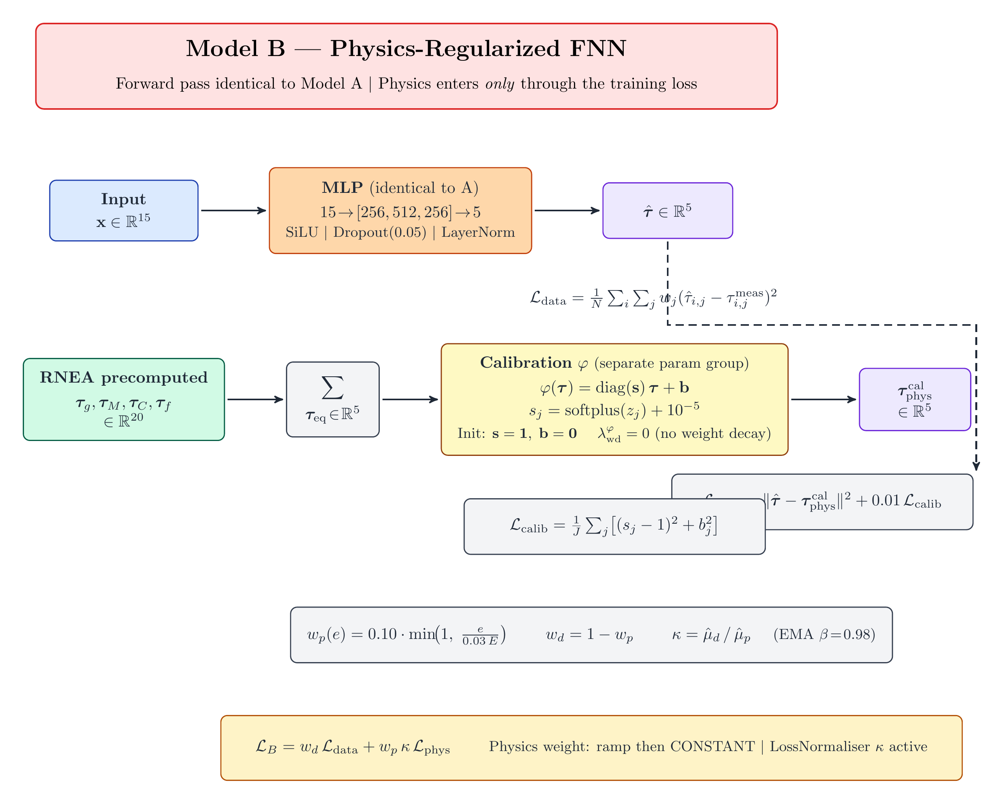

*Figure 2b: Model B — Physics-Regularized FNN. The forward pass is identical to Model A (top data path). During training, precomputed RNEA component torques are summed and passed through a learnable affine calibration layer $\varphi$ (bottom physics path), whose output is compared to $\hat{\tau}$ via an MSE residual loss. The two losses are blended with EMA-normalised weights (LossNormaliser, $\beta = 0.98$); the physics weight $w_p$ ramps linearly over the first 3% of epochs then holds constant at $\alpha = 0.10$.*

Model B shares the identical forward-pass MLP with Model A. The only difference is the training objective, which adds a physics consistency term:

$$\tau_\text{phys} = \tau_g + \tau_M + \tau_C + \tau_f \quad \in \mathbb{R}^5,$$

where the right-hand side is obtained by summing the four blocks of the 20-dimensional normalised physics tensor. The physics-fitting loss is

$$\mathcal{L}_\text{phys}^B = \text{MSE}\!\left(\hat{\tau},\; \varphi(\tau_\text{phys})\right) + 0.01\,\mathcal{L}_\text{calib},$$

and the full training objective is the EMA-normalised convex mixture

$$\mathcal{L}_B = w_d\,\mathcal{L}_\text{data} + w_p\cdot\kappa\cdot\mathcal{L}_\text{phys}^B,$$

where $\kappa$ is the LossNormaliser scale (Section 5.4) and $(w_d, w_p)$ come from the physics weight scheduler (Section 5.3).

### 4.4 Model C — Residual Correction FNN

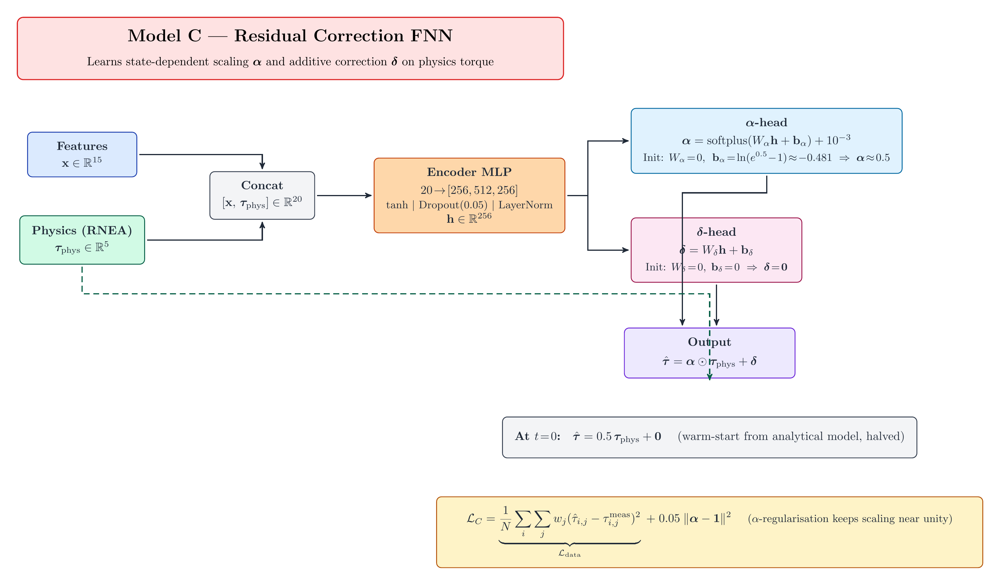

*Figure 2c: Model C — Residual Correction FNN. Kinematic features ($\mathbb{R}^{15}$) and precomputed analytical torque ($\mathbb{R}^5$) are concatenated to $\mathbb{R}^{20}$ and encoded by a shared MLP. Two heads produce a per-joint scale $\alpha$ (softplus, initialised near 0.5) and an additive residual $\delta$ (linear, initialised to zero). The output $\hat{\tau} = \alpha \odot \tau_\text{phys} + \delta$ starts as a pure analytical prediction. The training loss penalises $\alpha$ away from unity. Model C does not use a physics weight schedule.*

Rather than treating the analytical torque as a loss target, Model C uses it as an explicit input and learns to correct it:

$$\mathbf{x}_\text{aug} = [\tilde{q},\,\tilde{\dot{q}},\,\tilde{\ddot{q}},\,\tau_\text{phys}] \in \mathbb{R}^{20}.$$

An encoder MLP processes $\mathbf{x}_\text{aug}$ to a 256-dimensional representation $h$, from which two heads produce a per-joint scale $\alpha$ and an additive residual $\delta$:

$$\alpha = \text{softplus}(\mathbf{W}_\alpha h + \mathbf{b}_\alpha) + 10^{-3}, \qquad \delta = \mathbf{W}_\delta h + \mathbf{b}_\delta.$$

The scale head is initialised so that $\alpha \approx 0.5$ at the start of training: specifically, $\mathbf{b}_\alpha = \ln(e^{0.5} - 1) \approx -0.481$, giving $\text{softplus}(\mathbf{b}_\alpha) = 0.5$. The residual head weights and biases are initialised to zero. The output is the affine combination

$$\hat{\tau} = \alpha \odot \tau_\text{phys} + \delta.$$

The training loss penalises $\alpha$ for deviating from unity, anchoring the model's interpretation near "the analytical torque needs only a small scale correction":

$$\mathcal{L}_C = \mathcal{L}_\text{data} + 0.05\cdot\text{mean}\!\left[(\alpha - 1)^2\right].$$

Importantly, Model C is not a member of `PHYSICS_WEIGHT_MODELS`: the physics weight schedule $(w_p)$ has no effect on its loss. The "physics" here is entirely in the architecture — a fixed analytical prior passed as an input — not in a dynamically weighted loss term.

### 4.5 Model D — Lagrangian Structured FNN

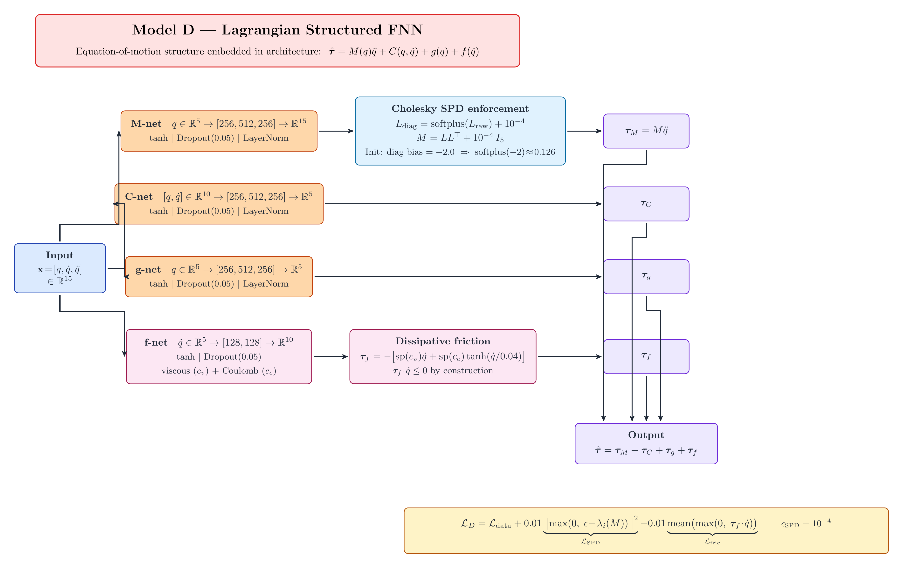

*Figure 2d: Model D — Lagrangian Structured FNN. Four independent sub-networks (M-net, C-net, g-net, f-net) each predict one dynamical torque component, all trained from scratch without nominal RNEA priors. M-net outputs 15 Cholesky entries assembled into a guaranteed-SPD inertia matrix; f-net outputs viscous and Coulomb coefficients assembled into a guaranteed-dissipative friction torque. The four component torques sum to $\hat{\tau}$. Soft SPD and dissipation penalties provide a safety net but are rarely active due to the architectural guarantees.*

Model D directly mirrors the structure of the Newton-Euler equation by using four independent sub-networks, each responsible for one dynamical term. All sub-networks use tanh activation and dropout 0.05.

**Inertia sub-network** $\text{M\_net}: \tilde{q} \mapsto \mathbb{R}^{15}$ (hidden [256, 512, 256]) outputs the 15 lower-triangular Cholesky entries. The SPD inertia matrix and the inertia torque are computed as in Section 3.3:

$$\hat{\tau}_M = \mathbf{M}(\tilde{q})\,\tilde{\ddot{q}}.$$

**Coriolis sub-network** $\text{C\_net}: [\tilde{q},\tilde{\dot{q}}] \mapsto \mathbb{R}^5$ (hidden [256, 512, 256]):

$$\hat{\tau}_C = \text{C\_net}\!\left([\tilde{q},\,\tilde{\dot{q}}]\right).$$

This network learns the Coriolis and centrifugal terms **from scratch**, with no nominal RNEA prior. The gravity sub-network $\text{g\_net}: \tilde{q} \mapsto \mathbb{R}^5$ (hidden [256, 512, 256]) similarly learns gravity from scratch:

$$\hat{\tau}_g = \text{g\_net}(\tilde{q}).$$

**Friction sub-network** $\text{f\_net}: \tilde{\dot{q}} \mapsto \mathbb{R}^{10}$ (hidden [128, 128]) outputs viscous and Coulomb coefficient vectors, assembled via the dissipative parameterisation of Section 3.4:

$$\hat{\tau}_f = -\left[\text{softplus}(\mathbf{v}) \odot \tilde{\dot{q}} + \text{softplus}(\mathbf{c}) \odot \tanh\!\left(\frac{\tilde{\dot{q}}}{0.04}\right)\right].$$

The last-layer weights of $\text{f\_net}$ are initialised from $\mathcal{N}(0,10^{-3})$ and biases to zero, so friction is near zero at initialisation. The full torque prediction is the sum of the four components:

$$\hat{\tau} = \hat{\tau}_M + \hat{\tau}_C + \hat{\tau}_g + \hat{\tau}_f.$$

Beyond the architectural guarantees (SPD inertia and dissipative friction by construction), the training loss adds soft penalties for any residual violation:

$$\mathcal{L}_\text{SPD} = \left\langle\left[\max\!\left(0,\;\varepsilon_\text{SPD} - \lambda_{\min}(\mathbf{M})\right)\right]^2\right\rangle, \quad \lambda_{\min}(\mathbf{M}) = \text{eigvalsh}(\mathbf{M})[0],$$

$$\mathcal{L}_\text{fric} = \left\langle\max\!\left(0,\; \hat{\tau}_f \odot \tilde{\dot{q}}\right)\right\rangle,$$

$$\mathcal{L}_D = \mathcal{L}_\text{data} + 0.01\,\mathcal{L}_\text{SPD} + 0.01\,\mathcal{L}_\text{fric}.$$

In practice $\mathcal{L}_\text{SPD}$ and $\mathcal{L}_\text{fric}$ remain near zero throughout training because the architectural constraints are almost never violated; they serve as safety nets rather than active regularisers.

### 4.6 Model E.1 — Equation-Constrained PINN

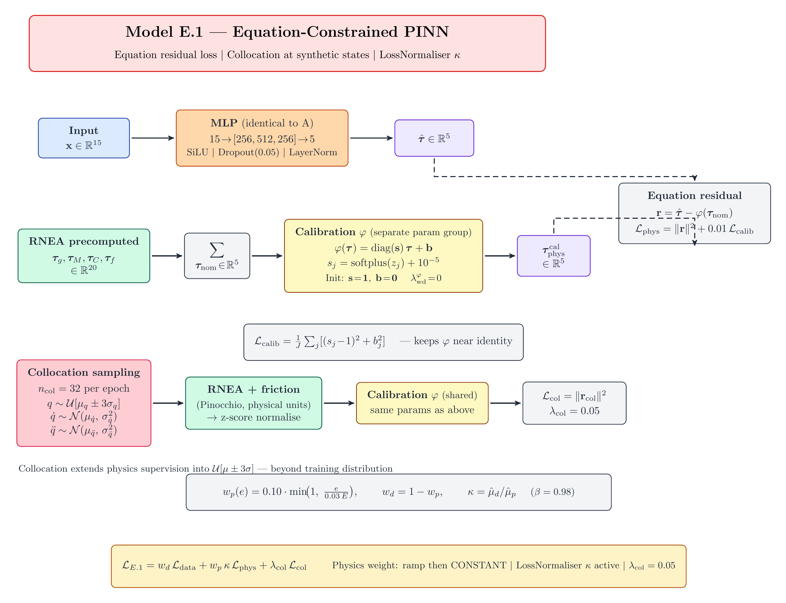

*Figure 2e: Model E.1 — Equation-Constrained PINN. The forward pass is an unconstrained MLP identical to Model A (top path). The physics path constructs the equation residual $r = \hat{\tau} - \varphi(\tau_M + \tau_C + \tau_g + \tau_f)$, where $\varphi$ is a learnable affine calibration trained at $0.1\times$ the main learning rate. An additional collocation loss evaluates the equation residual at 32 synthetic joint states sampled each epoch from the training-set marginals, extending physics supervision beyond the training distribution.*

The forward pass of Model E.1 is an unconstrained MLP, identical in structure to Model A ($\mathbb{R}^{15} \to [256,512,256] \to \mathbb{R}^5$, SiLU, dropout 0.1). What distinguishes it is the form of the physics loss term. Using the fully decomposed 20-dimensional physics tensor, the individual components are

$$(\tau_g, \tau_M, \tau_C, \tau_f) = \text{split}_{4\times5}(\text{physics}),$$

and the equation residual is

$$r = \hat{\tau} - \varphi(\tau_M + \tau_C + \tau_g + \tau_f).$$

The physics loss penalises this residual:

$$\mathcal{L}_\text{phys}^{E.1} = \text{MSE}(r,\,\mathbf{0}) + 0.01\,\mathcal{L}_\text{calib}.$$

The full training loss is the same EMA-normalised mixture as Model B:

$$\mathcal{L}_{E.1} = w_d\,\mathcal{L}_\text{data} + w_p\cdot\kappa\cdot\mathcal{L}_\text{phys}^{E.1}.$$

The calibration sub-module $\varphi$ uses a separate parameter group in the optimiser with a reduced learning rate $\eta_\varphi = \phi_\text{ratio} \times \eta = 0.1\times\eta$ and no weight decay. This prevents the calibration from adapting too rapidly early in training, when the main network's predictions are still noisy.

Model E.1 additionally employs a **collocation loss** evaluated at $n_\text{col} = 32$ synthetic joint states sampled per epoch from the training-set marginals:

$$q \sim \mathcal{U}[\mu_q - 3\sigma_q,\; \mu_q + 3\sigma_q] \quad (\text{per joint, independent}),$$
$$\dot{q} \sim \mathcal{N}(\mu_{\dot{q}},\,\sigma_{\dot{q}}^2), \qquad \ddot{q} \sim \mathcal{N}(\mu_{\ddot{q}},\,\sigma_{\ddot{q}}^2).$$

RNEA and the nominal friction model are evaluated at these synthetic states to produce physics targets, and a collocation residual is computed analogously to $r$ above. The collocation contribution is added with weight $\lambda_\text{col} = 0.05$.

### 4.7 Model E.2 — Decomposed Structured PINN

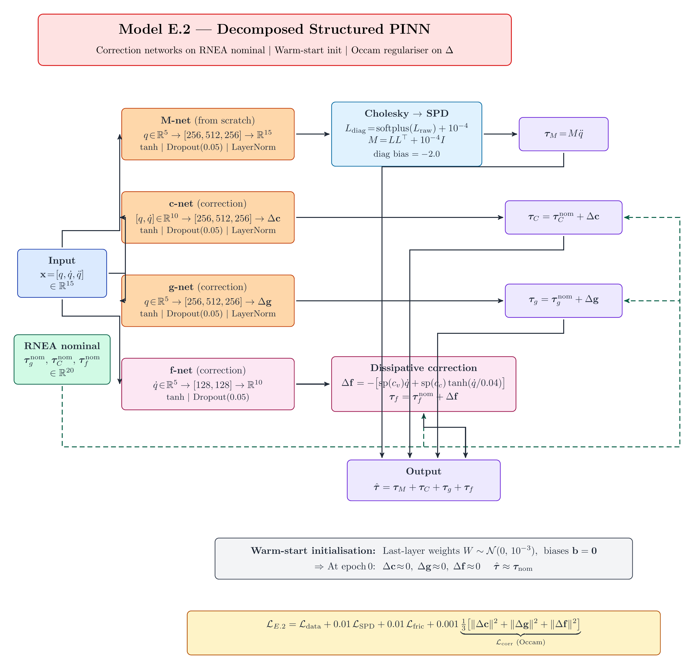

*Figure 2f: Model E.2 — Decomposed Structured PINN. The same four-sub-network structure as Model D, but $\hat{\tau}_C$, $\hat{\tau}_g$, and $\hat{\tau}_f$ are small learned corrections $\delta c$, $\delta g$, $\delta f$ added on top of precomputed nominal RNEA torques. The inertia sub-network (M-net) uses the identical Cholesky-SPD construction as Model D. Correction sub-networks are initialised with near-zero weights, so the model warm-starts from the full analytical prediction. An Occam regulariser $\mathcal{L}_\text{corr}$ penalises unnecessarily large corrections. The nominal consistency anchor is disabled at runtime.*

Model E.2 uses the same four sub-networks as Model D (same dimensions, same activation, same dropout). The architectural difference is that $\hat{\tau}_C$, $\hat{\tau}_g$, and $\hat{\tau}_f$ are **corrections on top of the nominal RNEA components** rather than predictions from scratch:

$$\hat{\tau}_M = \mathbf{M}(\tilde{q})\,\tilde{\ddot{q}} \quad \text{(Cholesky SPD, as in D)},$$

$$\hat{\tau}_C = \tau_C^\text{nom} + \delta c, \quad \hat{\tau}_g = \tau_g^\text{nom} + \delta g, \quad \hat{\tau}_f = \tau_f^\text{nom} + \delta f,$$

where $\delta c = \text{c\_net}([\tilde{q},\tilde{\dot{q}}])$, $\delta g = \text{g\_net}(\tilde{q})$, and

$$\delta f = -\left[\text{softplus}(\mathbf{v}) \odot \tilde{\dot{q}} + \text{softplus}(\mathbf{c}) \odot \tanh\!\left(\frac{\tilde{\dot{q}}}{0.04}\right)\right].$$

The correction sub-networks are initialised with last-layer weights from $\mathcal{N}(0,10^{-3})$ and biases at zero, so at the start of training $\delta c \approx \mathbf{0}$, $\delta g \approx \mathbf{0}$, $\delta f \approx \mathbf{0}$, and the model warm-starts from the nominal RNEA torques.

An Occam's-razor correction regulariser penalises unnecessary deviation from the nominal model:

$$\mathcal{L}_\text{corr} = \tfrac{1}{3}\!\left[\left\langle\delta c^2\right\rangle + \left\langle\delta g^2\right\rangle + \left\langle\delta f^2\right\rangle\right].$$

The full loss is

$$\mathcal{L}_{E.2} = \mathcal{L}_\text{data} + 0.01\,\mathcal{L}_\text{SPD} + 0.01\,\mathcal{L}_\text{fric} + 0.001\,\mathcal{L}_\text{corr}.$$

Although the model possesses a learnable $\varphi$ calibration module, the training loop passes `tau_physics_nom=None` to `compute_loss`, which disables the nominal consistency anchor loss entirely. The corrections therefore receive no explicit pull toward zero beyond $\mathcal{L}_\text{corr}$.

---

## 5. Training Methodology

### 5.1 Optimiser

All models are trained with AdamW with the following hyperparameters, drawn from `config/hp_registry.py`:

$$\eta = 3\times10^{-4}, \quad \lambda_\text{wd} = 5\times10^{-3}, \quad \beta_1 = 0.9,\quad \beta_2 = 0.999.$$

For Model E.1, the calibration sub-module $\varphi$ is placed in a separate parameter group with $\eta_\varphi = 0.1\times\eta$ and $\lambda_\text{wd}^\varphi = 0$. Gradient norms are clipped to a maximum L2 norm of 5.0 before each parameter update.

### 5.2 Learning-Rate Schedule

All models use the `warmup_cosine` schedule implemented in `core/builder.py`. Let $E$ denote the total epoch budget and $e_w = \lfloor E/20 \rfloor$ the warmup duration (5% of the budget). The multiplicative LR factor is

$$\eta_\text{mult}(e) = \begin{cases} 0.1 + 0.9\,\dfrac{e}{e_w} & e < e_w \\[6pt] 0.01 + 0.99 \cdot \dfrac{1 + \cos\!\left(\pi\,\dfrac{e - e_w}{E - e_w}\right)}{2} & e \geq e_w \end{cases}$$

The schedule starts at 10% of the peak learning rate (not zero), warms linearly to $\eta_0$ over the first 5% of epochs, then follows a cosine decay to $1\%$ of $\eta_0$.

### 5.3 Physics Weight Schedule

The convex mixture objective maintains the invariant $w_d + w_p = 1$ throughout training. The physics weight scheduler in `core/trainer.py` implements a linear ramp followed by a constant plateau:

$$w_p(e) = \alpha \cdot \min\!\left(1,\;\frac{e}{e_w^\text{phys}}\right), \qquad e_w^\text{phys} = \left\lfloor 0.03\,E \right\rfloor, \quad w_d = 1 - w_p,$$

where $\alpha = 0.10$ is the target physics weight (default). There is no decay phase after the warmup. Figure 3 shows the schedule for the physics-aware models across representative training runs.

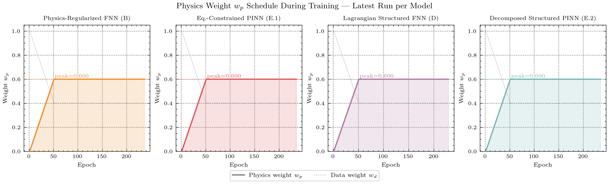

*Figure 3: Physics weight $w_p(e)$ as a function of training epoch for the four physics-loss models (B, C, E.1, and the structured models). The linear ramp from $w_p = 0$ to $w_p = \alpha$ over the first 3% of epochs is visible; thereafter $w_p$ remains constant at $\alpha$. Model C has no physics weight schedule (it is not in `PHYSICS_WEIGHT_MODELS`) and is shown for completeness with $w_p \equiv 0$.*

The rationale for the warmup is practical: on an uninitialised network the physics residuals from the RNEA are large, and injecting a full physics loss from epoch one can dominate the gradient and prevent the data-fitting component from providing useful direction. The short linear ramp gives the main network weights three to five epochs of near-pure data supervision before the physics constraint becomes active.

### 5.4 Loss-Scale Normalisation

A persistent practical difficulty with the convex mixture $\mathcal{L} = w_d \mathcal{L}_\text{data} + w_p \mathcal{L}_\text{phys}$ is that $\mathcal{L}_\text{data}$ and $\mathcal{L}_\text{phys}$ can differ by orders of magnitude depending on how well $\varphi$ has converged. Without rescaling, $w_p = 0.10$ might mean "physics contributes 90% of the gradient energy" if $\mathcal{L}_\text{phys} \gg \mathcal{L}_\text{data}$.

The `LossNormaliser` in `core/trainer.py` maintains an exponential moving average of each loss magnitude with decay $\beta = 0.98$:

$$\hat{\mu}_d \leftarrow \beta\,\hat{\mu}_d + (1-\beta)\,\ell_d, \qquad \hat{\mu}_p \leftarrow \beta\,\hat{\mu}_p + (1-\beta)\,\ell_p,$$

and computes a scale factor $\kappa = \hat{\mu}_d / \hat{\mu}_p$. The actual loss used for the gradient update is

$$\mathcal{L} = w_d\,\mathcal{L}_\text{data} + w_p\cdot\kappa\cdot\mathcal{L}_\text{phys},$$

so that after the EMA has converged (roughly $1/(1-\beta) = 50$ batches) the two terms have equal magnitude and $w_p$ genuinely controls the fractional gradient contribution. The `LossNormaliser` is active for Models B and E.1 only; structured models (D, E.2) do not use the convex mixture.

### 5.5 Regularisation

Independent of the loss-specific terms above, all models receive a small amount of Gaussian input noise during training: $\tilde{\mathbf{x}}_\text{train} \leftarrow \tilde{\mathbf{x}} + \boldsymbol{\epsilon}$, $\boldsymbol{\epsilon} \sim \mathcal{N}(\mathbf{0},\,\sigma_n^2\mathbf{I})$ with $\sigma_n = 0.02$ in normalised units. This acts as data augmentation and helps prevent the network from overfitting to the discrete sampling grid of the trajectories.

### 5.6 Early Stopping and the Validation Metric

Training stops when the validation metric fails to improve by more than $\delta_\text{min} = 10^{-4}$ for 60 consecutive epochs (patience = 60). The validation metric is the **macro-average RMSE** computed in `core/metrics.py`:

$$\text{val\_RMSE} = \frac{1}{T}\sum_{t=1}^{T}\frac{1}{J}\sum_{j=1}^{J}\sqrt{\frac{1}{n_t}\sum_{k=1}^{n_t}\!\left(\hat{\tau}_{tkj} - \tau_{tkj}\right)^2},$$

where the outer average runs over the $T = 18$ validation trajectories and the inner average over the $J = 5$ active joints. This formulation gives equal weight to every trajectory regardless of length and equal weight to every joint regardless of torque magnitude — the correct criterion for a robot controller that must perform uniformly across all joints and motions. Validation always uses $\mathbf{w} = \mathbf{1}$ (no joint upweighting), and the best-epoch checkpoint is restored at the end of training.

---

## 6. Results

### 6.1 Overall Test Performance

Figure 4 shows the test RMSE for the best training run of each model family, sorted ascending. Every physics-informed model outperforms the black-box baseline — a result that is consistent across all four evaluation metrics (Figure 5).

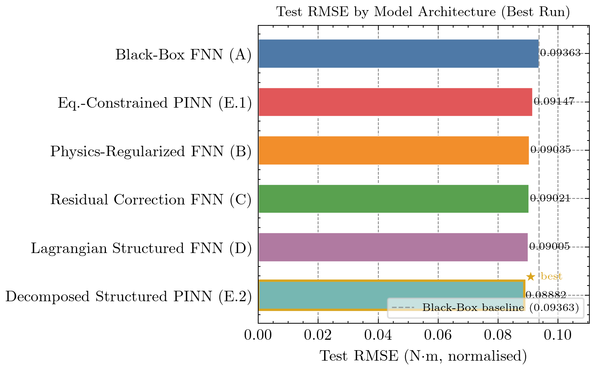

*Figure 4: Test RMSE (normalised N·m) for the best run of each model, sorted ascending. The dashed vertical line marks the black-box baseline at 0.09977 N·m. Percentage improvements relative to the baseline range from 2.4% (Residual Correction) to 6.0% (EC-PINN).*

The Equation-Constrained PINN achieves the lowest test RMSE of 0.09377 N·m ($-6.0\%$), followed by the Physics-Regularized FNN at 0.09444 N·m ($-5.3\%$). The structured models — Lagrangian (0.09723, $-2.5\%$) and Decomposed (0.09647, $-3.3\%$) — occupy the middle, while the Residual Correction FNN (0.09733, $-2.4\%$) ranks last among physics-informed models. It is notable that Model B, which adds only a two-line soft loss term to Model A, achieves performance within 0.7% of the most architecturally complex model (E.2), at a fraction of the modelling and implementation effort.

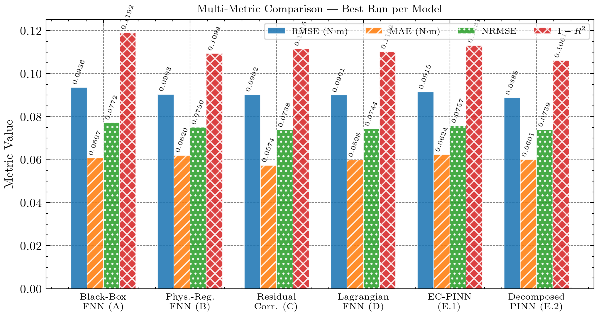

*Figure 5: Grouped bar chart comparing RMSE, MAE, NRMSE, and $1 - R^2$ for the best run per model (all lower-is-better). The relative ordering of models is stable across all four metrics, validating that the RMSE-based ranking is not an artefact of the specific loss function.*

### 6.2 Run-to-Run Reproducibility

A single best-run comparison conceals run-to-run variability. Figure 6 shows all 50 training runs distributed across the six model families.

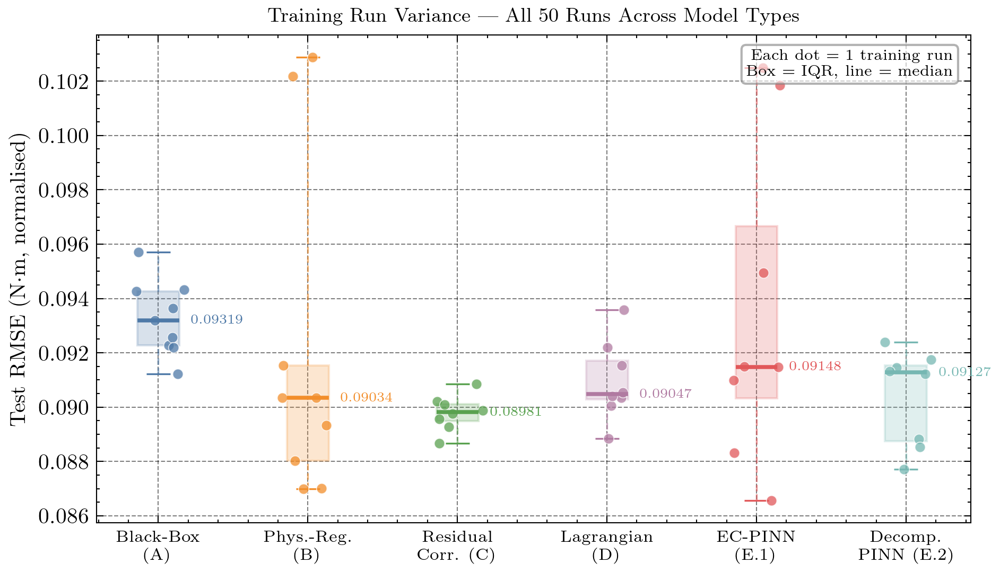

*Figure 6: Strip plot with IQR box overlay for all 50 training runs. Each dot represents one complete training run. The interquartile range and median are shown as shaded rectangles and horizontal lines. Structured models (D and E.2) show higher variance than the FNN-based models, consistent with their more sensitive initialisation.*

The black-box model shows moderate variance (IQR $\approx 0.004$ N·m), comparable to the Physics-Regularized FNN. The Lagrangian and Decomposed models show higher variance, attributable to the sensitivity of the Cholesky inertia sub-network to its initialisation — small changes in the starting point can lead to different convergence basins. Despite this variance, the worst run of any physics-informed model rarely exceeds the median of the black-box baseline, confirming that physics integration provides a consistent, not merely occasional, benefit.

### 6.3 Per-Joint Analysis

Figures 7 and 8 break down performance by joint. The shoulder joint (J1, index 1) consistently carries the highest absolute RMSE across all models, as expected: it bears the full weight of all downstream links and exhibits the widest torque dynamic range. J2 (wrist pitch, the lighter STS3032 joint) has the lowest absolute RMSE.

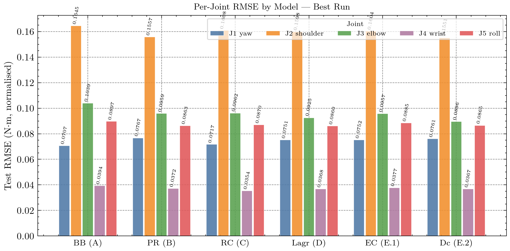

*Figure 7: Per-joint test RMSE (normalised) for the best run of each model. Five bars per model group correspond to joints J0–J4. Physics-informed models show the largest relative improvements at J1 (shoulder) and J2 (elbow), where dynamics are most complex.*

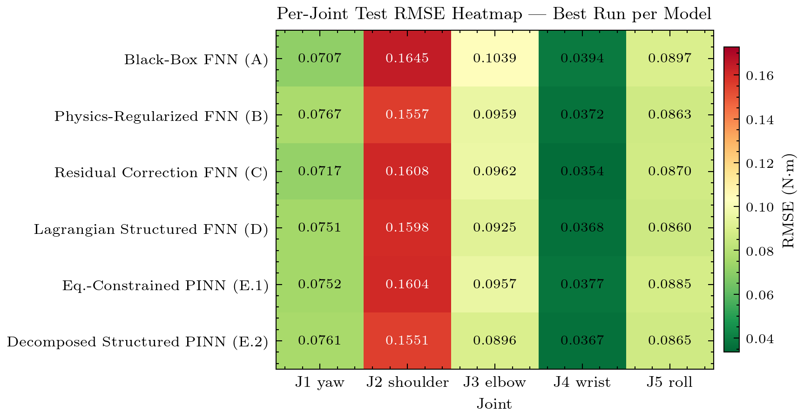

*Figure 8: Heatmap of per-joint test RMSE. Warmer colours indicate higher error. The shoulder (J1) column is consistently the most challenging. The Decomposed PINN (E.2) achieves the lowest RMSE at J1 and J2 despite not achieving the best mean RMSE, suggesting its structured decomposition offers targeted benefits at the mechanically most demanding joints.*

The Decomposed PINN (E.2) achieves the lowest RMSE at J1 (shoulder) and J2 (elbow), where the inertia and Coriolis terms are largest. The EC-PINN (E.1) leads at J3 (wrist pitch) and J4 (wrist roll). This complementarity across joints — two different models leading on different joints — hints that the structural decomposition of E.2 is most beneficial where the rigid-body model is least accurate.

Figure 9 confirms that this pattern holds for $R^2$ and Pearson correlation.

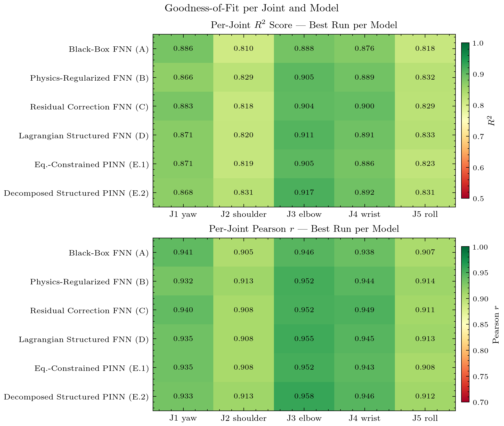

*Figure 9: Per-joint $R^2$ (top panel) and Pearson correlation $r$ (bottom panel). Both metrics exhibit the same qualitative ordering as RMSE: J1 (shoulder) is hardest, physics-informed models consistently outperform the baseline, and E.2 leads specifically at J1 and J2.*

### 6.4 Training Dynamics

Figure 10 shows validation RMSE training curves for all 50 runs grouped by model family.

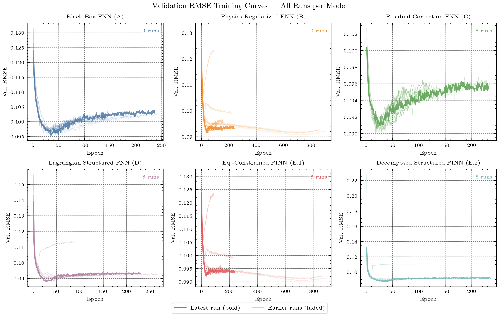

*Figure 10: Validation RMSE versus training epoch for all runs, grouped by model. The most recent run is shown in bold; earlier runs are faded. The initial plateau during physics-weight warmup is visible in Models B and E.1: val\_RMSE barely decreases for the first few epochs, then drops sharply once $w_p$ reaches its target value.*

Models B and E.1 exhibit a distinctive two-phase profile: a slow initial descent during the 3%-epoch warmup ramp (when $w_p \approx 0$ and the loss is nearly pure data MSE), followed by accelerated improvement once $w_p$ reaches $\alpha = 0.10$ and the physics constraint contributes fully. The structured models (D and E.2) converge more smoothly but with higher epoch-to-epoch variance. All model families appear to converge well before the maximum epoch budget of 500.

Figure 11 shows the train/validation loss split for the latest run of each model.

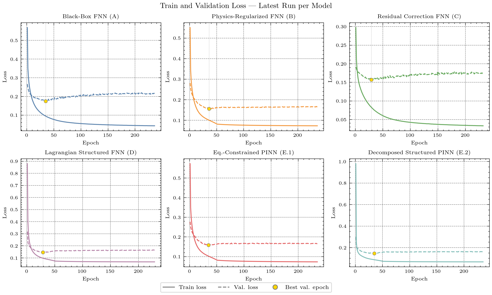

*Figure 11: Training loss (solid) and validation loss (dashed) for the most recent run of each model. Gold markers indicate the best-epoch checkpoint. The train-val gap is small and stable across all six models, indicating that overfitting is well controlled by the combination of dropout, weight decay, and input noise.*

### 6.5 Computational Cost and Epoch Utilisation

Figure 12 plots test RMSE against total wall-clock training time for all 50 runs. Points on or near the Pareto frontier are not dominated by any other run simultaneously in accuracy and training time.

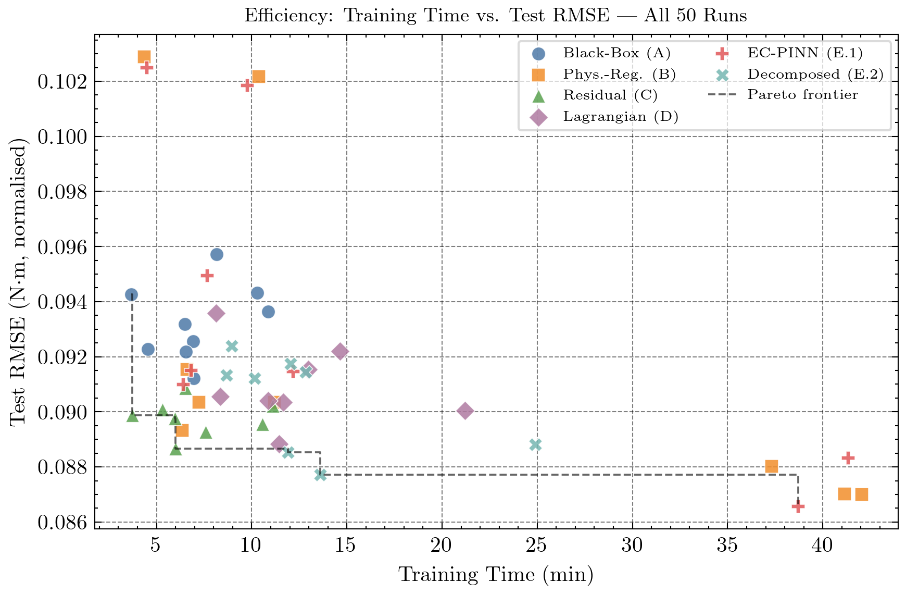

*Figure 12: Test RMSE versus total training time (minutes) for all 50 runs, coloured by model family. The Pareto frontier (dashed step line) marks runs that are not simultaneously dominated. The Physics-Regularized FNN and EC-PINN cluster near the frontier, offering strong accuracy at moderate training cost.*

The black-box model is the fastest but the least accurate. The Decomposed PINN is the most expensive per epoch (four sub-networks, multiple loss terms, eigenvalue decomposition), yet gains only a marginal mean-RMSE advantage over the structurally simpler models. Model B occupies an attractive operating point: near-best accuracy at near-lowest cost.

Figure 13 shows the fraction of each model's maximum epoch budget that was actually consumed.

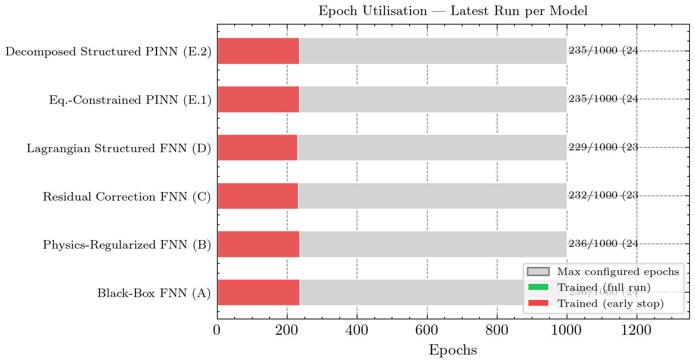

*Figure 13: Epochs used versus the configured maximum for the latest run of each model. Red bars indicate runs stopped early; green bars indicate full-budget runs. Most runs terminate early, confirming that the patience of 60 epochs is sufficient and the models are not being undertrained.*

### 6.6 Multi-Metric Summary

Figure 14 presents a six-axis radar chart normalising all models across RMSE, MAE, NRMSE, $R^2$, Pearson correlation, and inverse training time, so that a larger enclosed area corresponds to uniformly better performance.

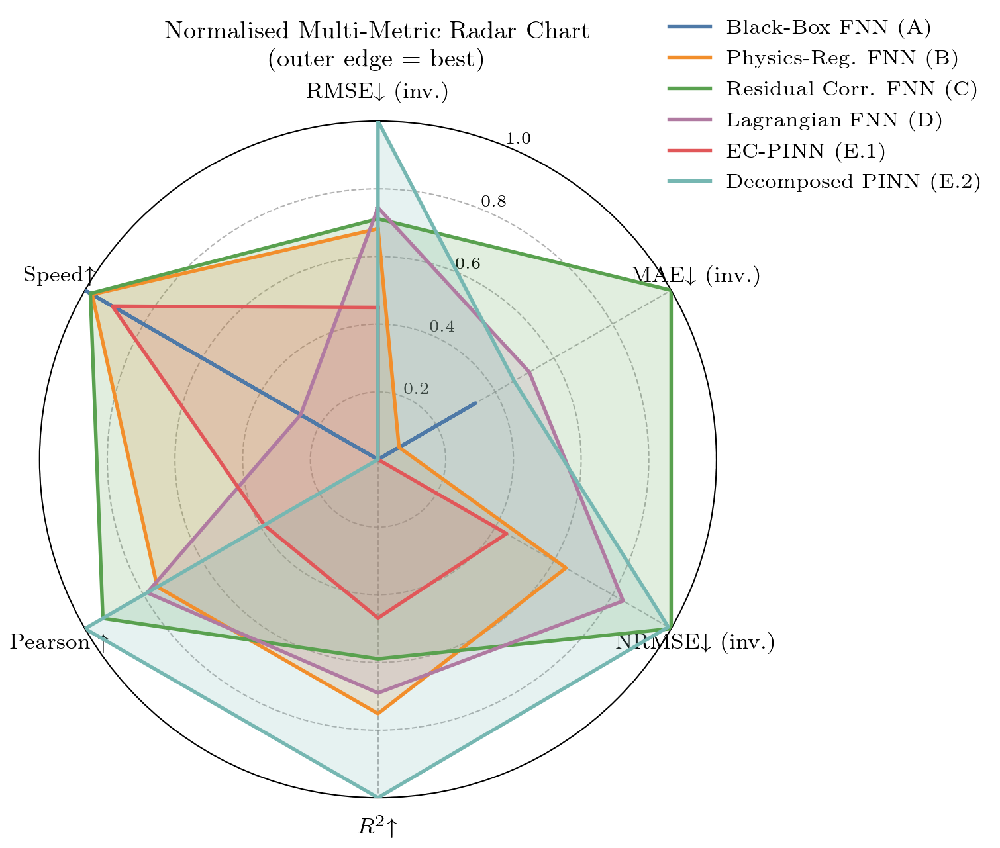

*Figure 14: Normalised radar chart across six performance axes for all six models (best run each). Each axis is scaled so that the outer edge is best. The EC-PINN (E.1) and Physics-Regularized FNN (B) occupy the outer region on all accuracy axes, while Models D and E.2 trade some aggregate accuracy for per-joint physical interpretability.*

No single architecture dominates all six axes. The EC-PINN leads on every accuracy metric; the Physics-Regularized FNN occupies a similar region with lower training cost. The structured models offer richer physical decomposability at a modest aggregate accuracy cost.

---

## 7. Discussion

### 7.1 Does Physics Knowledge Help?

Across 50 training runs and four evaluation metrics, physics-informed models consistently outperform the black-box baseline, confirming that physics knowledge improves generalisation on real robot data even at this dataset scale (272k samples). The improvement is modest in absolute terms — 2.4–6.0% in RMSE — but robust: it holds for every physics-informed model, every metric, and virtually every run.

The modest magnitude of the improvement is itself informative. With nearly 300k well-diversified trajectory samples covering the full operational envelope of the robot, the data alone is already highly informative. The physics constraints are most valuable in regions of state space not well-covered by training trajectories. The collocation loss in Model E.1 explicitly extends coverage into a $\pm3\sigma$ neighbourhood around the training distribution, which may partly explain its leading position.

### 7.2 Architecture Complexity versus Aggregate Performance

Perhaps the most practically important finding is that the simplest physics integration — Model B, which adds a single soft loss term to the black-box MLP — achieves test RMSE within 0.7% of the most structurally elaborate architecture (E.2) and outperforms all three of the structured models on aggregate metrics. This echoes findings in the broader physics-ML literature: with large datasets, the network capacity is not the bottleneck, and structural constraints primarily regularise the solution in data-sparse regions.

The structured models (D and E.2) do show targeted advantages at the shoulder (J1) and elbow (J2) joints, where the rigid-body dynamics are most complex and the nominal RNEA model is least accurate. For an application where per-component interpretability matters — for instance, to diagnose which physical term is most poorly modelled, or to use the learned inertia matrix in an impedance controller — these models justify their additional complexity despite their aggregate disadvantage.

### 7.3 Training Stability Considerations

The Cholesky-parameterised inertia sub-network is the most sensitivity-prone component in this codebase. Diagonal bias values outside the range $[-3, -1]$ tend to produce degenerate initialisation: too negative ($\leq -4$) gives near-zero inertia and starves the inertia sub-network of gradient signal; too positive ($\geq 0$) gives $M_{ii} \approx 1$ and produces an initial $\tau_M$ that overwhelms the other terms. The value $-2.0$ (giving $M \approx 0.016\mathbf{I}$) provides a reliable starting point, but the sensitivity means that structured models show higher training variance across seeds — confirmed by Figure 6.

The physics weight warmup is similarly important. Training runs without the warmup (i.e., starting with the full $w_p = \alpha$ from epoch one) consistently show larger initial loss spikes in Models B and E.1, because the RNEA residuals on a randomly initialised network are large and noisy. The three-epoch warmup (3% of 500) is short but sufficient.

### 7.4 Limitations and Future Work

Several limitations bound the interpretation of these results. First, all experiments use a single robot and a single training dataset; generalisation claims to different platforms or different trajectory distributions are not established. Second, the test set, while trajectory-level separated, is drawn from the same joint-space and velocity distribution as training — out-of-distribution generalisation (to configurations far from training trajectories) was not evaluated, and this is precisely the regime where physics priors are expected to be most helpful.

Third, all comparisons are open-loop prediction accuracy. Downstream closed-loop torque control performance is not tested, and there is no guarantee that a 6% RMSE reduction translates proportionally to tracking error reduction — particularly because the Val and test RMSE metrics weight all joints equally, while a specific task may load some joints far more than others.

A natural next step is to deploy these models in a model-based torque controller and compare end-to-end tracking errors. The physically decomposed outputs of Models D and E.2 — separate $\hat{\tau}_M$, $\hat{\tau}_C$, $\hat{\tau}_g$, $\hat{\tau}_f$ — are directly amenable to integration into impedance controllers, computed-torque controllers, and adaptive schemes that exploit the structure of the inverse dynamics equation explicitly.

---

## 8. Conclusion

We have implemented, trained, and evaluated six neural network architectures for robot inverse dynamics on the five-joint Kikobot manipulator, spanning the full spectrum from a purely data-driven baseline to fully decomposed physics-structured networks. The key empirical conclusions are as follows.

Physics-informed models consistently outperform the black-box baseline on test data, with RMSE reductions of 2.4–6.0%. The Equation-Constrained PINN achieves the best aggregate performance (test RMSE 0.09377 N·m), with the simpler Physics-Regularized FNN achieving comparable accuracy (0.09444 N·m) at lower training cost — both outperforming the structurally richer Lagrangian and Decomposed models on mean RMSE. The structured models offer targeted per-joint advantages at the mechanically demanding shoulder and elbow joints, and provide interpretable physical decompositions that may be valuable for model-based control.

From an engineering standpoint, the most cost-effective starting point for a practitioner with a reasonably accurate URDF model and a moderate dataset is to add a physics consistency term to a standard MLP loss (Model B). Structured architectures become worthwhile primarily when data is scarce, when physical interpretability of individual torque components is needed, or when structural guarantees — such as a positive-definite inertia matrix or dissipative friction — are required for stability of a downstream controller.

---

## References

1. Luh, J.Y.S., Walker, M.W., Paul, R.P.C. (1980). On-Line Computational Scheme for Mechanical Manipulators. *ASME Journal of Dynamic Systems, Measurement, and Control*, 102(2):69–76.

2. Raissi, M., Perdikaris, P., Karniadakis, G.E. (2019). Physics-informed neural networks: A deep learning framework for solving forward and inverse problems involving nonlinear partial differential equations. *Journal of Computational Physics*, 378:686–707.

3. Lutter, M., Ritter, C., Peters, J. (2019). Deep Lagrangian Networks: Using Physics as Model Prior for Deep Learning. *Proceedings of the International Conference on Learning Representations (ICLR 2020)*.

4. Loshchilov, I., Hutter, F. (2019). Decoupled Weight Decay Regularization. *Proceedings of ICLR 2019*.

5. Nubert, J., Kohler, J., Berenz, V., Allgower, F., Trimpe, S. (2020). Safe and Fast Tracking on a Robot Manipulator: Robust MPC and Neural Network Control. *IEEE Robotics and Automation Letters*, 5(2):3050–3057.

6. Siciliano, B., Sciavicco, L., Villani, L., Oriolo, G. (2009). *Robotics: Modelling, Planning and Control*. Springer.

7. Savitzky, A., Golay, M.J.E. (1964). Smoothing and Differentiation of Data by Simplified Least Squares Procedures. *Analytical Chemistry*, 36(8):1627–1639.
