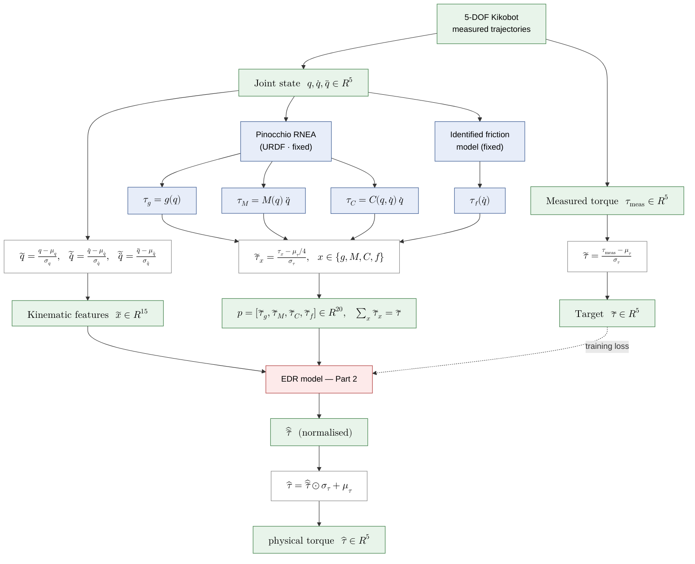
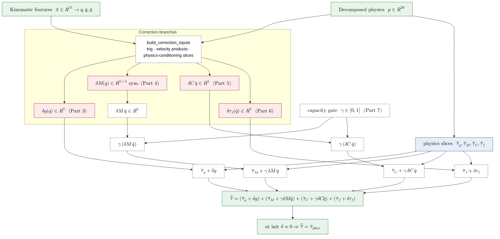
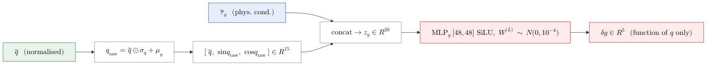
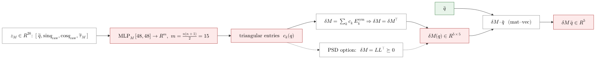
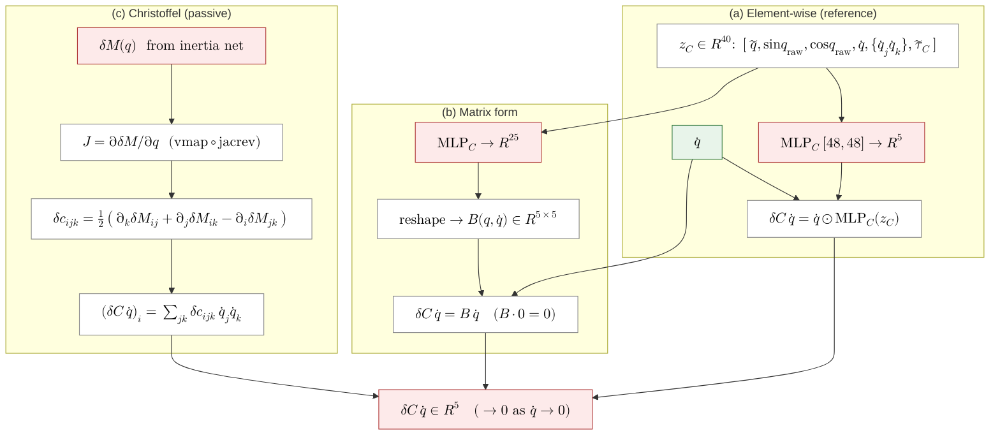
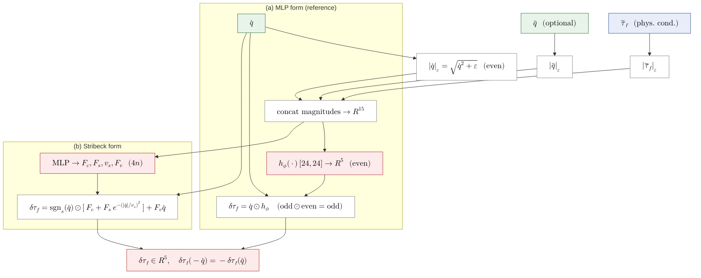
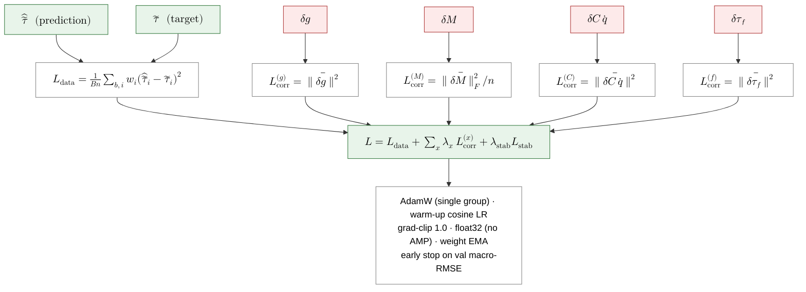

# EDR Architecture — Mermaid Flowcharts (split in parts)

Detailed, mathematically explicit flowcharts of the Equivariant–Decomposed–Residual
(EDR) network for 5-DOF Kikobot inverse-dynamics. Each part is a self-contained
`mermaid` diagram. Formula nodes use **KaTeX math** (`$$ … $$`); process/IO boxes
are plain text. Colour key:

- **green** = inputs / outputs (I/O)
- **blue**  = analytical / fixed physics (RNEA + friction, *not learned*)
- **red**   = learned correction (δ-networks)
- **white** = deterministic operation (normalise, scatter, product, sum)

Render to readable images (math typeset by KaTeX) with:

```bash
mmdc -i EDR_flowcharts.md -o renders/edr.svg -b white -c mermaid.json -p puppeteer.json
# mermaid.json: {"theme":"base","flowchart":{"htmlLabels":true,"useMaxWidth":false}}
# then rasterise each SVG to PNG with headless Chrome (KaTeX renders correctly).
```

> Note: KaTeX labels must be **single-line** (`\\`, `<br/>` collapse); each node is
> one `$$…$$` expression with `\text{}` for words.

---

## Part 1 — Data pipeline & nominal physics decomposition



---

## Part 2 — EDR forward pass (top level)



---

## Part 3 — Gravity correction



---

## Part 4 — Inertia correction



---

## Part 5 — Coriolis correction (three constructions)



---

## Part 6 — Friction correction (odd by construction)



---

## Part 7 — Smooth capacity gate (curriculum)

```mermaid
flowchart LR
  E["$$\text{epoch }e,\ \text{budget }E,\ \rho=0.30$$"]:::io --> COS["$$\gamma(e)=\tfrac12\big(1-\cos\tfrac{\pi(e-1)}{\lceil\rho E\rceil}\big),\ e\le\lceil\rho E\rceil;\ \ \gamma=1\ \text{else}$$"]:::op
  COS --> G["$$\gamma\in[0,1]$$"]:::op
  G --> APPLY["$$\gamma\;\text{scales }\delta M\ddot q,\ \delta C\dot q\;\text{only (gravity, friction full)}$$"]:::op
  APPLY --> INF["$$\text{inference / after ramp:}\;\; \gamma=1$$"]:::io

  classDef io fill:#e8f4ea,stroke:#3a7d44,color:#000;
  classDef op fill:#ffffff,stroke:#888888,color:#000;
```



---

## Part 8 — Training objective & optimisation


