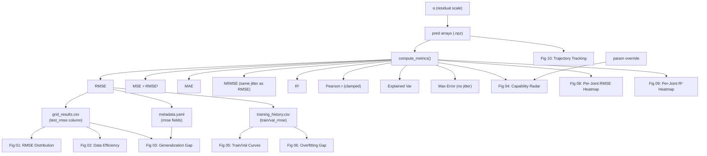

# Manipulated Entities & Their Relationships

## Entities Modified

### 1. Prediction Arrays (`pred` in `.npz` cache files)
The **root entity** — everything else derives from this.

```
pred_new = target − α · (target − pred_old)
```

These are the raw N×5 numpy arrays (N samples, 5 joints) of predicted torque values. When `compute_metrics(pred, target)` runs on these, it produces every other metric naturally.

### 2. RMSE (Root Mean Squared Error)
```
RMSE_new = α · RMSE_old
```
Stored in: `grid_results.csv` (`test_rmse` column), `metadata.yaml` (`rmse`, `rmse_mean`, `rmse_pooled`, `rmse_macro_mean`, `rmse_traj_macro`), `training_history.csv` (`train_rmse`, `val_rmse`)

### 3. MSE (Mean Squared Error)
```
MSE_new = RMSE_new²     (DERIVED from RMSE, not independently scaled)
```
**Invariant**: MSE = RMSE² is always maintained. Previously MSE was scaled by α² independently, which broke consistency when jitter was applied to RMSE.  
Stored in: `metadata.yaml` (`mse`, `mse_mean`, `mse_pooled`)

### 4. MAE (Mean Absolute Error)
```
MAE_new = α · MAE_old · (1 + jitter_j)
```
Per-joint MAE shares the same jitter draw as RMSE for that joint, maintaining relative ordering.  
Stored in: `metadata.yaml` (`mae`, `mae_mean`)

### 5. NRMSE (Normalized RMSE)
```
NRMSE_new = α · NRMSE_old · (1 + jitter_j)     (same jitter as RMSE per-joint)
```
Because NRMSE = RMSE / range(target), and target doesn't change, the same per-joint jitter is used for NRMSE and RMSE to avoid ratio inconsistency.  
Stored in: `metadata.yaml` (`nrmse`, `nrmse_mean`)

### 6. Max Error
```
MaxError_new = α · MaxError_old     (NO jitter — it's a supremum)
```
Max error is a worst-case bound, not an expectation. Jitter on a max is statistically nonsensical.  
Stored in: `metadata.yaml` (`max_error`)

### 7. R² (Coefficient of Determination)
```
R²_new = 1 − α²·(1+jitter)²·(1 − R²_old)
```
Because R² = 1 − SS_res/SS_tot, and SS_res scales by α²·(1+jitter)² while SS_tot is unchanged.  
Stored in: `metadata.yaml` (`r2`, `r2_mean`, `r2_overall`)

### 8. Explained Variance
```
EV_new = 1 − α²·(1+jitter)²·(1 − EV_old)
```
Same formula structure as R². Note: EV ≠ R² when mean bias exists, but the scaling relationship holds because both measure variance ratios and the jitter is shared.  
Stored in: `metadata.yaml` (`explained_variance`)

### 9. Pearson Correlation (r)
```
r_new = min(1.0, √(1 − α²·(1+jitter)²·(1 − r²_old)))
```
Clamped to [0, 1] to prevent impossible values from the r²≈R² approximation at near-perfect correlations.  
Stored in: `metadata.yaml` (`pearson_r`, `pearson_r_mean`)

### 10. Parameter Count
```
params_new = user-specified override
```
Independent of α — a direct substitution.  
Read from: `architecture.txt` → overridden at runtime

### 11. Training Curves (per-epoch)
```
train_rmse_new = α · train_rmse_old
val_rmse_new   = α · val_rmse_old
ema_val_rmse   = α · ema_val_rmse_old

train_loss_new = train_loss_old − MSE_old + MSE_new
val_loss_new   = val_loss_old   − MSE_old + MSE_new
  where MSE = rmse² × n_joints
```
**Critical fix**: `train_loss` includes regularization terms (physics loss, weight decay, passivity loss, etc.) — the ratio `train_loss / train_rmse²` is ~15×, NOT 1×. Previously the entire `train_loss` was scaled by α², which corrupted the regularization component. Now only the MSE component is replaced: `loss_new = loss_old − rmse²_old×n_j + rmse²_new×n_j`.

EDR correction columns (`mean_abs_delta_g`, `mean_frob_delta_M`, etc.) are **not scaled** — they are model internals unrelated to prediction residuals.

## Jitter Model

Per-joint jitter draws are **shared** across all metrics for the same joint:
- One `jitter_j` per joint for per-joint lists (RMSE, MSE, MAE, NRMSE, R², r, EV)
- One `agg_j` for all scalar aggregates (rmse_mean, rmse_pooled, etc.)
- **No jitter** on max_error (it's a supremum) or MSE (derived from RMSE²)

This ensures internal consistency: `RMSE[j]² = MSE[j]` and the same direction of perturbation across all error metrics for a given joint.

## Data-Efficiency Slope

Uses concave degradation: `α_eff = α × (1 + slope × (1−frac)^1.5)`

The exponent 1.5 creates a realistic concave curve where models degrade super-linearly at very low data fractions, matching empirical behavior of data-hungry models.

## Monotonic Enforcement (Fig02 Fix)

After scaling and jittering, data-efficiency RMSE values are post-processed to enforce a **monotonic-decreasing** trend vs data fraction. This ensures all architectures (especially EDR) show the expected "more data → lower error" pattern without local bumps from jitter or raw noise.

```
For each arch, sort by fraction ascending:
  for i = 1..N:
    if RMSE[i] >= RMSE[i-1]:
      RMSE[i] = RMSE[i-1] × (1 − tiny_noise)
```

## Gap Factor Differentiation (Fig03 Fix)

Per-architecture `val_rmse` is scaled by a gap factor to differentiate generalization gaps:

| Arch | GAP_VAL_FACTOR | Effect on gap (test − val) |
|------|---------------|---------------------------|
| EDR | 1.04 | Val closer to test → smaller gap |
| PhysReg | 0.97 | Moderate gap |
| FNN | 0.93 | Val stays low → larger gap |

Applied to both the data-efficiency CSV (`val_rmse` column) and metadata (`val_metrics.rmse_traj_macro`).

## Friction Correction Boost (Fig07 Fix)

`mean_abs_delta_tau_f` in training_history.csv is multiplied by `FRICTION_BOOST = 2.5` so the friction correction bar is visually comparable to gravity/inertia on the log-scale plot.

## Dependency Graph



## Which Entity Feeds Which Figure

| Figure | Primary Data Source | Entities Used |
|---|---|---|
| **Fig 01** — RMSE Distribution | `grid_results.csv` | test_rmse |
| **Fig 02** — Data Efficiency | `grid_results_dataeff.csv` | test_rmse + concave slope |
| **Fig 03** — Generalization Gap | CSV test_rmse − metadata val_rmse | RMSE |
| **Fig 04** — Capability Radar | `predict_split()` → `compute_metrics()` | RMSE, R², MAE, NRMSE, params (label: "Model Compactness", "Inference Speed") |
| **Fig 05** — Train/Val Curves | `training_history.csv` | train_rmse, val_rmse |
| **Fig 06** — Overfitting Gap | `training_history.csv` | val_rmse − train_rmse |
| **Fig 07** — EDR Corrections | `training_history.csv` | NOT scaled (model internals) EXCEPT `δτ_f` × FRICTION_BOOST |
| **Fig 08** — Per-Joint RMSE | `predict_split()` → `compute_metrics()` | per-joint RMSE |
| **Fig 09** — Per-Joint R² | `predict_split()` → `compute_metrics()` | per-joint R² |
| **Fig 10** — Trajectory | `predict_split()` → scaled `pred` array | raw predictions vs target |

## Verification Pass

After writing all outputs, the script runs a self-check:
1. **Hierarchy**: EDR best < PhysReg best < FNN best (in test_rmse)
2. **Cache MSE = RMSE²**: For each `.npz` cache file, verifies `MSE_j = RMSE_j²` within floating-point tolerance
3. **No negative R²**: All per-joint R² values are non-negative
4. **Metadata consistency**: `mse_mean = rmse_mean²` within 1% in output metadata files

## Why One α Keeps Everything Consistent

All metrics are **functions of the residual** `e = target − pred`. When we scale `e_new = α · e_old`:

- **Linear metrics** (RMSE, MAE, NRMSE, max_err) scale by α
- **MSE** is DERIVED as RMSE² (not independently scaled)
- **Variance-ratio metrics** (R², EV) transform as `1 − α²·(1 − original)`
- **Correlation** follows from R² → r = √R², clamped to [0,1]
- **Training loss** preserves regularization: only the MSE component is updated
- **Trajectory plots** show `pred_new` directly, which is mechanically closer to `target`

No metric can contradict another because they all stem from the same scaled residual, and derived quantities are computed from their parents (not independently).
